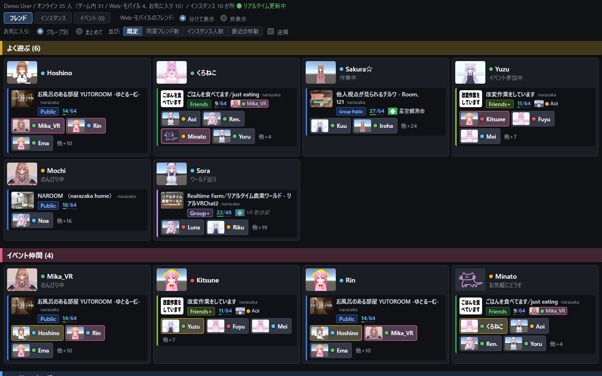
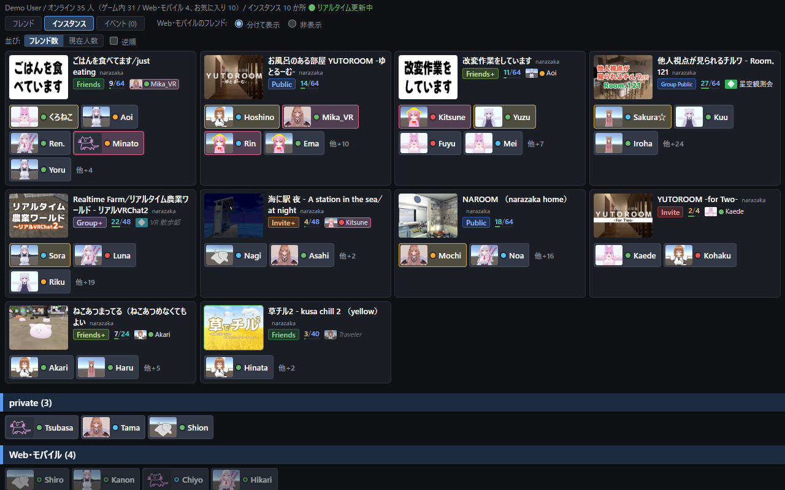
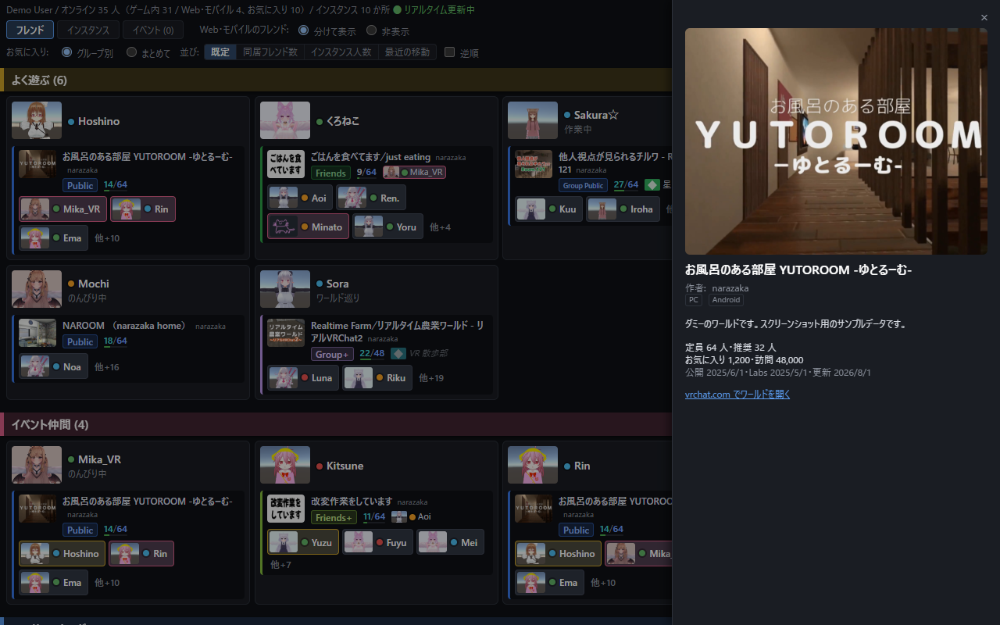

# VRC Social Overview

VRChat のフレンドの居場所とインスタンスを見やすく一覧するブラウザ拡張機能です（Chrome / Firefox）。

**VRChat の非公式ツールです。VRChat Inc. とは関係がなく、承認も受けていません。** 非公式の VRChat API を使っているため、VRChat 側の変更で動かなくなることがあります。

## 主な機能

- フレンドをお気に入りグループごとに並べ、居場所（ワールド・インスタンスの種別・人数・オーナー・同じインスタンスにいるフレンド）を表示
- インスタンスごとの一覧
- プロフィール・ワールドの詳細表示
- ゲーム内でインスタンスを開く（VRChat 起動中はメニューに詳細が出る。招待は送らない）
- リアルタイム更新（VRChat の Pipeline）とイベントログ

## スクリーンショット

フレンド名などはダミーです。





## 使い方

1. ブラウザで [vrchat.com](https://vrchat.com/home) にログインしておく
2. ツールバーの本拡張のボタンを押すと、一覧のページが開く

ログイン情報は本拡張に入力しません。ブラウザのログイン状態をそのまま使います。

## プライバシー

開発者や第三者にデータを送りません。詳しくは [PRIVACY.md](PRIVACY.md) を参照してください。

## ビルド

必要なもの:

- Node.js 24
- pnpm 11.15.1（`corepack enable` で `package.json` の `packageManager` に書かれた版が使われます）

```sh
pnpm install --frozen-lockfile
pnpm build           # Chrome 用 → .output/chrome-mv3/
pnpm build:firefox   # Firefox 用 → .output/firefox-mv3/
```

ストア提出用の zip は `pnpm zip` / `pnpm zip:firefox` で `.output/` に作られます。Firefox 用ではソースコードの zip も同時に作られます。

出力は審査で読めるよう minify していません。

開発時は `pnpm check`（型チェック）、`pnpm lint`、`pnpm format` を使います。

## ライセンス

[Zlib](LICENSE)
